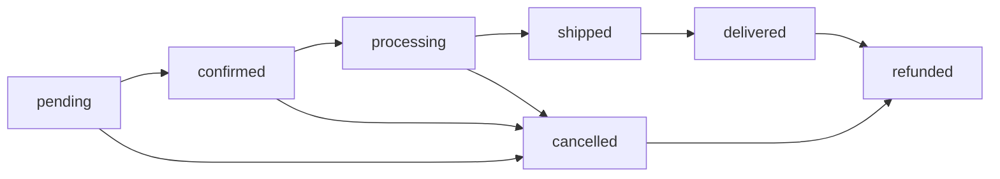

# Orders API

import SwaggerApiDocs from '@site/src/components/SwaggerApiDocs';

<SwaggerApiDocs 
  appName="orders"
  title="Orders API"
  description="The Orders API provides endpoints for managing shopping carts, orders, and payments in the e-commerce system. This includes cart management for authenticated and anonymous users, order processing and management, payment processing and tracking, and individual order items."
  serializers={[
    {
      name: 'CartSerializer',
      fields: {
        id: { type: 'IntegerField', required: false, read_only: true, help_text: 'Cart ID' },
        user: { type: 'ForeignKey', required: false, read_only: true, help_text: 'User this cart belongs to (null for anonymous)' },
        session_key: { type: 'CharField', required: false, help_text: 'Session key for anonymous users' },
        total_items: { type: 'IntegerField', required: false, read_only: true, help_text: 'Total number of items in cart' },
        total_price: { type: 'DecimalField', required: false, read_only: true, help_text: 'Total price of all items' },
        created_date: { type: 'DateTimeField', required: false, read_only: true, help_text: 'Cart creation date' },
        updated_date: { type: 'DateTimeField', required: false, read_only: true, help_text: 'Last update date' }
      },
      docstring: 'Shopping cart information and totals'
    },
    {
      name: 'CartItemSerializer', 
      fields: {
        id: { type: 'IntegerField', required: false, read_only: true, help_text: 'Cart item ID' },
        product: { type: 'ForeignKey', required: true, help_text: 'Product in the cart' },
        quantity: { type: 'IntegerField', required: true, help_text: 'Quantity of this product' },
        unit_price: { type: 'DecimalField', required: false, read_only: true, help_text: 'Price per unit' },
        total_price: { type: 'DecimalField', required: false, read_only: true, help_text: 'Total price for this line item' }
      },
      docstring: 'Individual item within a shopping cart'
    },
    {
      name: 'OrderSerializer',
      fields: {
        id: { type: 'IntegerField', required: false, read_only: true, help_text: 'Order ID' },
        order_number: { type: 'CharField', required: false, read_only: true, help_text: 'Unique order number' },
        user: { type: 'ForeignKey', required: true, help_text: 'User who placed the order' },
        status: { type: 'CharField', required: false, choices: [['pending', 'Pending'], ['confirmed', 'Confirmed'], ['processing', 'Processing'], ['shipped', 'Shipped'], ['delivered', 'Delivered'], ['cancelled', 'Cancelled']], help_text: 'Order status' },
        total_amount: { type: 'DecimalField', required: false, read_only: true, help_text: 'Total order amount' },
        shipping_address: { type: 'JSONField', required: true, help_text: 'Shipping address details' },
        billing_address: { type: 'JSONField', required: true, help_text: 'Billing address details' },
        payment_method: { type: 'CharField', required: true, help_text: 'Payment method used' },
        customer_notes: { type: 'TextField', required: false, help_text: 'Customer notes for the order' },
        created_date: { type: 'DateTimeField', required: false, read_only: true, help_text: 'Order creation date' },
        updated_date: { type: 'DateTimeField', required: false, read_only: true, help_text: 'Last update date' }
      },
      docstring: 'Complete order information including addresses and payment'
    },
    {
      name: 'PaymentSerializer',
      fields: {
        id: { type: 'IntegerField', required: false, read_only: true, help_text: 'Payment ID' },
        order: { type: 'ForeignKey', required: true, help_text: 'Order this payment is for' },
        amount: { type: 'DecimalField', required: true, help_text: 'Payment amount' },
        payment_method: { type: 'CharField', required: true, help_text: 'Payment method (credit_card, paypal, etc.)' },
        transaction_id: { type: 'CharField', required: false, help_text: 'External transaction identifier' },
        status: { type: 'CharField', required: false, choices: [['pending', 'Pending'], ['completed', 'Completed'], ['failed', 'Failed'], ['refunded', 'Refunded']], help_text: 'Payment status' },
        created_date: { type: 'DateTimeField', required: false, read_only: true, help_text: 'Payment date' }
      },
      docstring: 'Payment transaction details'
    }
  ]}
  endpoints={[
    // Cart Management
    { method: 'GET', path: '/api/carts/', description: 'Get current user cart', serializer_class: 'CartSerializer', tags: ['Cart Management'] },
    { method: 'GET', path: '/api/carts/{id}/', description: 'Get cart details', serializer_class: 'CartSerializer', tags: ['Cart Management'] },
    { method: 'POST', path: '/api/carts/add_item/', description: 'Add item to cart', serializer_class: 'CartItemSerializer', tags: ['Cart Management'] },
    { method: 'PATCH', path: '/api/carts/update_item/', description: 'Update cart item quantity', tags: ['Cart Management'] },
    { method: 'DELETE', path: '/api/carts/remove_item/', description: 'Remove item from cart', tags: ['Cart Management'] },
    { method: 'DELETE', path: '/api/carts/clear/', description: 'Clear all cart items', tags: ['Cart Management'] },
    { method: 'POST', path: '/api/carts/checkout/', description: 'Convert cart to order', serializer_class: 'OrderSerializer', tags: ['Cart Management'] },
    
    // Cart Items
    { method: 'GET', path: '/api/cart-items/', description: 'List cart items', serializer_class: 'CartItemSerializer', tags: ['Cart Management'] },
    { method: 'POST', path: '/api/cart-items/', description: 'Add cart item', serializer_class: 'CartItemSerializer', tags: ['Cart Management'] },
    { method: 'GET', path: '/api/cart-items/{id}/', description: 'Get cart item', serializer_class: 'CartItemSerializer', tags: ['Cart Management'] },
    { method: 'PUT', path: '/api/cart-items/{id}/', description: 'Update cart item', serializer_class: 'CartItemSerializer', tags: ['Cart Management'] },
    { method: 'DELETE', path: '/api/cart-items/{id}/', description: 'Delete cart item', tags: ['Cart Management'] },
    
    // Order Management
    { method: 'GET', path: '/api/orders/', description: 'List orders', serializer_class: 'OrderSerializer', tags: ['Order Management'] },
    { method: 'POST', path: '/api/orders/', description: 'Create new order', serializer_class: 'OrderSerializer', tags: ['Order Management'] },
    { method: 'GET', path: '/api/orders/{id}/', description: 'Get order details', serializer_class: 'OrderSerializer', tags: ['Order Management'] },
    { method: 'PUT', path: '/api/orders/{id}/', description: 'Update order (admin)', serializer_class: 'OrderSerializer', tags: ['Order Management'] },
    { method: 'PATCH', path: '/api/orders/{id}/', description: 'Partial order update', serializer_class: 'OrderSerializer', tags: ['Order Management'] },
    { method: 'DELETE', path: '/api/orders/{id}/', description: 'Cancel order', tags: ['Order Management'] },
    { method: 'GET', path: '/api/orders/my_orders/', description: 'Get current user orders', serializer_class: 'OrderSerializer', tags: ['Order Management'] },
    { method: 'GET', path: '/api/orders/recent/', description: 'Get recent orders (30 days)', serializer_class: 'OrderSerializer', tags: ['Order Management'] },
    { method: 'PATCH', path: '/api/orders/{id}/update_status/', description: 'Update order status (admin)', tags: ['Order Management'] },
    { method: 'POST', path: '/api/orders/{id}/cancel/', description: 'Cancel order', tags: ['Order Management'] },
    
    // Payment Management
    { method: 'GET', path: '/api/payments/', description: 'List payments', serializer_class: 'PaymentSerializer', tags: ['Payment Management'] },
    { method: 'GET', path: '/api/payments/{id}/', description: 'Get payment details', serializer_class: 'PaymentSerializer', tags: ['Payment Management'] },
    { method: 'PATCH', path: '/api/payments/{id}/update_status/', description: 'Update payment status (admin)', tags: ['Payment Management'] },
    { method: 'POST', path: '/api/payments/{id}/process/', description: 'Process payment (admin)', tags: ['Payment Management'] }
  ]}
/>

## Quick Examples

### Add Item to Cart

```bash
POST /api/carts/add_item/
Authorization: Bearer your-token-here
Content-Type: application/json

{
  "product": 1,
  "quantity": 2
}
```

### Checkout Cart

```bash
POST /api/carts/checkout/
Authorization: Bearer your-token-here
Content-Type: application/json

{
  "shipping_address": {
    "first_name": "John",
    "last_name": "Doe",
    "address_line_1": "123 Main St",
    "city": "Anytown",
    "state_province": "CA",
    "postal_code": "12345",
    "country": "US"
  },
  "billing_address": {
    "first_name": "John",
    "last_name": "Doe", 
    "address_line_1": "123 Main St",
    "city": "Anytown",
    "state_province": "CA",
    "postal_code": "12345",
    "country": "US"
  },
  "payment_method": "credit_card",
  "customer_notes": "Please leave at door"
}
```

## Legacy Documentation

## Cart Management

### Cart Endpoints

| Method | Endpoint | Description |
|--------|----------|-------------|
| GET | `/api/carts/` | Get current user's cart |
| GET | `/api/carts/{id}/` | Get cart details |
| POST | `/api/carts/add_item/` | Add item to cart |
| PATCH | `/api/carts/update_item/` | Update cart item quantity |
| DELETE | `/api/carts/remove_item/` | Remove item from cart |
| DELETE | `/api/carts/clear/` | Clear all cart items |
| POST | `/api/carts/checkout/` | Convert cart to order |

### Cart Items

| Method | Endpoint | Description |
|--------|----------|-------------|
| GET | `/api/cart-items/` | List cart items |
| POST | `/api/cart-items/` | Add cart item |
| GET | `/api/cart-items/{id}/` | Get cart item |
| PUT | `/api/cart-items/{id}/` | Update cart item |
| DELETE | `/api/cart-items/{id}/` | Delete cart item |

## Order Management

| Method | Endpoint | Description |
|--------|----------|-------------|
| GET | `/api/orders/` | List orders |
| POST | `/api/orders/` | Create new order |
| GET | `/api/orders/{id}/` | Get order details |
| PUT | `/api/orders/{id}/` | Update order (admin) |
| PATCH | `/api/orders/{id}/` | Partial order update |
| DELETE | `/api/orders/{id}/` | Cancel order |
| GET | `/api/orders/my_orders/` | Get current user's orders |
| GET | `/api/orders/recent/` | Get recent orders (30 days) |
| PATCH | `/api/orders/{id}/update_status/` | Update order status (admin) |
| POST | `/api/orders/{id}/cancel/` | Cancel order |

## Payment Management

| Method | Endpoint | Description |
|--------|----------|-------------|
| GET | `/api/payments/` | List payments |
| GET | `/api/payments/{id}/` | Get payment details |
| PATCH | `/api/payments/{id}/update_status/` | Update payment status (admin) |
| POST | `/api/payments/{id}/process/` | Process payment (admin) |

## Data Models

import DynamicTypeLoader from '@site/src/components/DynamicTypeLoader';

<DynamicTypeLoader 
  appName="orders"
  title="Orders App Data Models"
  showAllVariants={false}
/>

### Model Summary

The Orders app includes the following serializers:
- **CartItemSerializer**: 6 fields
- **CartSerializer**: 3 fields
- **OrderItemSerializer**: 0 fields  
- **OrderListSerializer**: 2 fields
- **OrderDetailSerializer**: 3 fields
- **OrderCreateSerializer**: 1 fields
- **OrderUpdateSerializer**: 0 fields
- **PaymentSerializer**: 1 fields
- **CartToOrderSerializer**: 4 fields

### 🎯 Why Multiple Languages & Naming Conventions?

Different development environments have different conventions:

- **Frontend Teams**: Often prefer `camelCase` properties for JavaScript/TypeScript
- **Backend Teams**: May prefer `snake_case` to match Python/Django conventions  
- **Mobile Teams**: iOS uses `PascalCase`, Android varies by language
- **Integration Teams**: Need to match existing codebases and style guides

Easy-SDK generates **all variants automatically** so every team can use their preferred style without manual conversion.

## Shopping Cart Flow

### Add Item to Cart

```bash
POST /api/carts/add_item/
Content-Type: application/json

{
  "product": 1,
  "quantity": 2
}
```

### Update Cart Item

```bash
PATCH /api/carts/update_item/
Content-Type: application/json

{
  "product": 1,
  "quantity": 3
}
```

### Checkout Process

```bash
POST /api/carts/checkout/
Content-Type: application/json
Authorization: Token your-token-here

{
  "shipping_address": {
    "first_name": "John",
    "last_name": "Doe",
    "address_line_1": "123 Main St",
    "city": "Anytown",
    "state_province": "CA",
    "postal_code": "12345",
    "country": "US"
  },
  "billing_address": {
    "first_name": "John",
    "last_name": "Doe",
    "address_line_1": "123 Main St",
    "city": "Anytown",
    "state_province": "CA",
    "postal_code": "12345",
    "country": "US"
  },
  "payment_method": "credit_card",
  "customer_notes": "Please leave at door"
}
```

## Order Status Workflow



Valid status transitions:
- `pending` → `confirmed`, `cancelled`
- `confirmed` → `processing`, `cancelled`  
- `processing` → `shipped`, `cancelled`
- `shipped` → `delivered`
- `delivered` → `refunded` (if needed)
- `cancelled` → `refunded` (if payment was taken)

## Permissions

- **Anonymous**: Cart management (session-based)
- **Authenticated**: Full cart and order access
- **Owner**: Users can only access their own orders
- **Staff/Admin**: Can update order status and manage payments