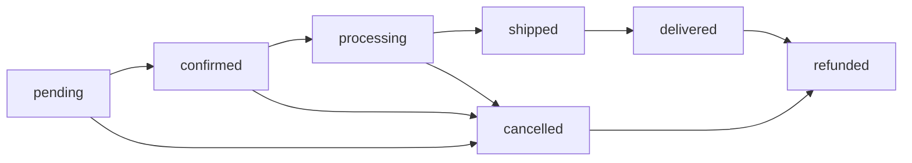

# Orders API

The Orders API provides endpoints for managing shopping carts, orders, and payments in the e-commerce system.

## Overview

The orders module includes:

- **Carts** - Shopping cart management for authenticated and anonymous users
- **Orders** - Order processing and management
- **Payments** - Payment processing and tracking
- **Order Items** - Individual items within orders

## Cart Management

### Cart Endpoints

| Method | Endpoint | Description |
|--------|----------|-------------|
| GET | `/api/carts/` | Get current user's cart |
| GET | `/api/carts/{id}/` | Get cart details |
| POST | `/api/carts/add_item/` | Add item to cart |
| PATCH | `/api/carts/update_item/` | Update cart item quantity |
| DELETE | `/api/carts/remove_item/` | Remove item from cart |
| DELETE | `/api/carts/clear/` | Clear all cart items |
| POST | `/api/carts/checkout/` | Convert cart to order |

### Cart Items

| Method | Endpoint | Description |
|--------|----------|-------------|
| GET | `/api/cart-items/` | List cart items |
| POST | `/api/cart-items/` | Add cart item |
| GET | `/api/cart-items/{id}/` | Get cart item |
| PUT | `/api/cart-items/{id}/` | Update cart item |
| DELETE | `/api/cart-items/{id}/` | Delete cart item |

## Order Management

| Method | Endpoint | Description |
|--------|----------|-------------|
| GET | `/api/orders/` | List orders |
| POST | `/api/orders/` | Create new order |
| GET | `/api/orders/{id}/` | Get order details |
| PUT | `/api/orders/{id}/` | Update order (admin) |
| PATCH | `/api/orders/{id}/` | Partial order update |
| DELETE | `/api/orders/{id}/` | Cancel order |
| GET | `/api/orders/my_orders/` | Get current user's orders |
| GET | `/api/orders/recent/` | Get recent orders (30 days) |
| PATCH | `/api/orders/{id}/update_status/` | Update order status (admin) |
| POST | `/api/orders/{id}/cancel/` | Cancel order |

## Payment Management

| Method | Endpoint | Description |
|--------|----------|-------------|
| GET | `/api/payments/` | List payments |
| GET | `/api/payments/{id}/` | Get payment details |
| PATCH | `/api/payments/{id}/update_status/` | Update payment status (admin) |
| POST | `/api/payments/{id}/process/` | Process payment (admin) |

## Data Models

import DynamicTypeLoader from '@site/src/components/DynamicTypeLoader';

<DynamicTypeLoader 
  appName="orders"
  title="Orders App Data Models"
  showAllVariants={false}
/>

### Model Summary

The Orders app includes the following serializers:
- **CartItemSerializer**: 6 fields
- **CartSerializer**: 3 fields
- **OrderItemSerializer**: 0 fields  
- **OrderListSerializer**: 2 fields
- **OrderDetailSerializer**: 3 fields
- **OrderCreateSerializer**: 1 fields
- **OrderUpdateSerializer**: 0 fields
- **PaymentSerializer**: 1 fields
- **CartToOrderSerializer**: 4 fields

### 🎯 Why Multiple Languages & Naming Conventions?

Different development environments have different conventions:

- **Frontend Teams**: Often prefer `camelCase` properties for JavaScript/TypeScript
- **Backend Teams**: May prefer `snake_case` to match Python/Django conventions  
- **Mobile Teams**: iOS uses `PascalCase`, Android varies by language
- **Integration Teams**: Need to match existing codebases and style guides

Easy-SDK generates **all variants automatically** so every team can use their preferred style without manual conversion.

## Shopping Cart Flow

### Add Item to Cart

```bash
POST /api/carts/add_item/
Content-Type: application/json

{
  "product": 1,
  "quantity": 2
}
```

### Update Cart Item

```bash
PATCH /api/carts/update_item/
Content-Type: application/json

{
  "product": 1,
  "quantity": 3
}
```

### Checkout Process

```bash
POST /api/carts/checkout/
Content-Type: application/json
Authorization: Token your-token-here

{
  "shipping_address": {
    "first_name": "John",
    "last_name": "Doe",
    "address_line_1": "123 Main St",
    "city": "Anytown",
    "state_province": "CA",
    "postal_code": "12345",
    "country": "US"
  },
  "billing_address": {
    "first_name": "John",
    "last_name": "Doe",
    "address_line_1": "123 Main St",
    "city": "Anytown",
    "state_province": "CA",
    "postal_code": "12345",
    "country": "US"
  },
  "payment_method": "credit_card",
  "customer_notes": "Please leave at door"
}
```

## Order Status Workflow



Valid status transitions:
- `pending` → `confirmed`, `cancelled`
- `confirmed` → `processing`, `cancelled`  
- `processing` → `shipped`, `cancelled`
- `shipped` → `delivered`
- `delivered` → `refunded` (if needed)
- `cancelled` → `refunded` (if payment was taken)

## Permissions

- **Anonymous**: Cart management (session-based)
- **Authenticated**: Full cart and order access
- **Owner**: Users can only access their own orders
- **Staff/Admin**: Can update order status and manage payments